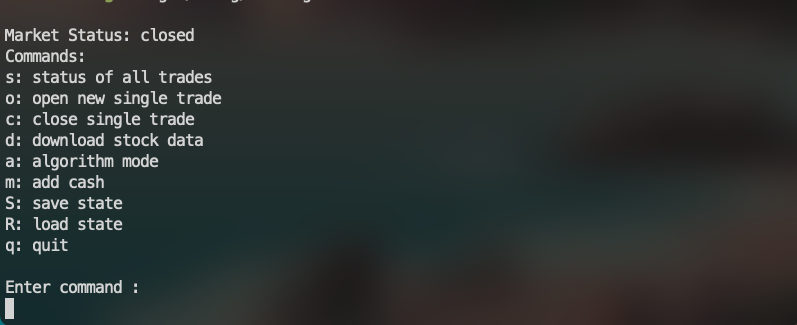
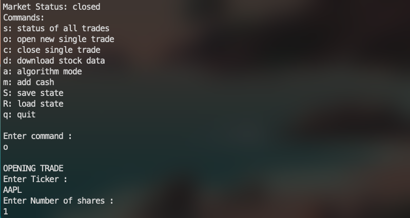
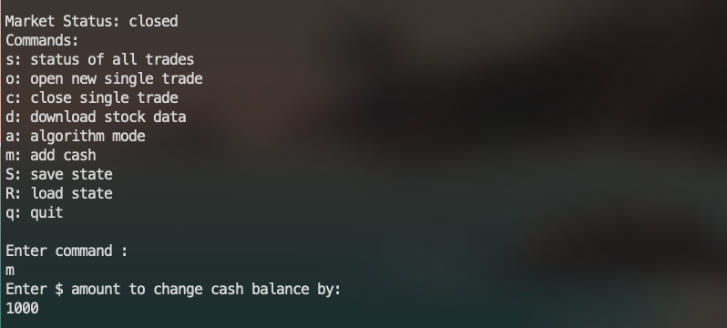
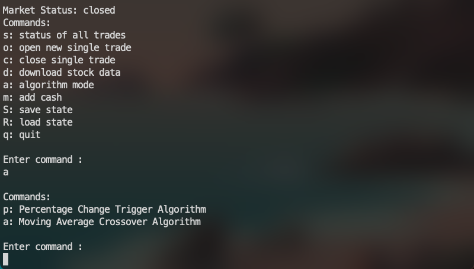
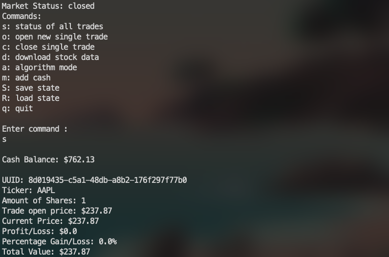
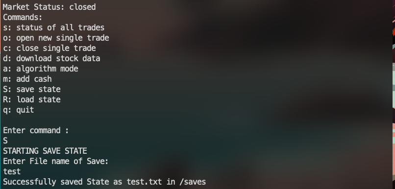
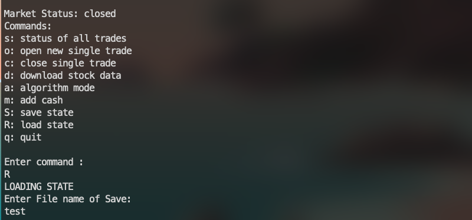

<!-- Improved compatibility of back to top link: See: https://github.com/othneildrew/Best-README-Template/pull/73 -->
<a id="readme-top"></a>
<!--
*** Thanks for checking out the Best-README-Template. If you have a suggestion
*** that would make this better, please fork the repo and create a pull request
*** or simply open an issue with the tag "enhancement".
*** Don't forget to give the project a star!
*** Thanks again! Now go create something AMAZING! :D
-->


<!-- PROJECT SHIELDS -->
<!--
*** I'm using markdown "reference style" links for readability.
*** Reference links are enclosed in brackets [ ] instead of parentheses ( ).
*** See the bottom of this document for the declaration of the reference variables
*** for contributors-url, forks-url, etc. This is an optional, concise syntax you may use.
*** https://www.markdownguide.org/basic-syntax/#reference-style-links
-->
[![Contributors][contributors-shield]][contributors-url]
[![Forks][forks-shield]][forks-url]
[![Stargazers][stars-shield]][stars-url]
[![Issues][issues-shield]][issues-url]
[![project_license][license-shield]][license-url]
[![LinkedIn][linkedin-shield]][linkedin-url]


<!-- PROJECT LOGO -->
<br />
<div align="center">
<!--
  <a href="https://github.com/jacobcorbett/trading-bot">
    
  </a>
 -->
<h3 align="center">Trading Bot in Rust</h3>

<!--


  <p align="center">
    project_description
    <br />
    <a href="https://github.com/jacobcorbett/trading-bot"><strong>Explore the docs »</strong></a>
    <br />
    <br />
    <a href="https://github.com/jacobcorbett/trading-bot">View Demo</a>
    &middot;
    <a href="https://github.com/jacobcorbett/trading-bot/issues/new?labels=bug&template=bug-report---.md">Report Bug</a>
    &middot;
    <a href="https://github.com/jacobcorbett/trading-bot/issues/new?labels=enhancement&template=feature-request---.md">Request Feature</a>
  </p>
  -->
</div>


<!-- TABLE OF CONTENTS -->
<details>
  <summary>Table of Contents</summary>
  <ol>
    <li>
      <a href="#about-the-project">About The Project</a>
    </li>
    <li>
      <a href="#getting-started">Getting Started</a>
      <ul>
        <li><a href="#prerequisites">Prerequisites</a></li>
        <li><a href="#installation">Installation</a></li>
      </ul>
    </li>
    <li><a href="#usage">Usage</a></li>
    <li><a href="#roadmap">Roadmap</a></li>
    <li><a href="#contributing">Contributing</a></li>
    <li><a href="#license">License</a></li>
    <li><a href="#contact">Contact</a></li>
    <li><a href="#acknowledgments">Acknowledgments</a></li>
  </ol>
</details>


<!-- ABOUT THE PROJECT -->
## About The Project




This project combines my personal interest in stocks and trading with my goal of enhancing my skills in Rust. Each step of the development process is documented and shared on YouTube in an easy-to-follow series. 

You can follow along with the entire journey here: [YouTube Playlist](https://www.youtube.com/playlist?list=PLHXKgc2IyVv-QrPcpdF68LgoTbEMS0u6f).


<p align="right">(<a href="#readme-top">back to top</a>)</p>

<!--
### Built With

* 
* [![React][React.js]][React-url]
* [![Vue][Vue.js]][Vue-url]
* [![Angular][Angular.io]][Angular-url]
* [![Svelte][Svelte.dev]][Svelte-url]
* [![Laravel][Laravel.com]][Laravel-url]
* [![Bootstrap][Bootstrap.com]][Bootstrap-url]
* [![JQuery][JQuery.com]][JQuery-url]

<p align="right">(<a href="#readme-top">back to top</a>)</p>
  -->


<!-- GETTING STARTED -->
## Getting Started

This is an example of how you may give instructions on setting up your project locally.
To get a local copy up and running follow these simple example steps.

### Prerequisites

You must have a [Finnhub](https://finnhub.io/) and [Alpha Vantage](https://www.alphavantage.co/) API key, In the format belwow in a .env file in root.
- .env file
  ```text
  FINHUB_API_KEY=key
  ALPHA_API_KEY=key
  ```

### Installation

1. Get a free Finnhub API Key at  [https://finnhub.io](https://finnhub.io)
2. Get a free Alpha Vantage API Key at  [https://www.alphavantage.co](https://www.alphavantage.co)
3. Clone the repo
   ```sh
   git clone https://github.com/jacobcorbett/trading-bot.git
   ```
4. Run the project
   ```sh
   cargo run
   ```


<p align="right">(<a href="#readme-top">back to top</a>)</p>


<!-- USAGE EXAMPLES -->
## Usage

Below are examples of how to use the trading bot, along with screenshots showcasing key features.

### 1. Opening a Trade  
Start by opening a new trade using the bot's intuitive command-line interface.  


### 2. Adding Money  
Easily manage your trading balance by adding funds as needed.  


### 3. Algorithm Mode  
Switch to algorithm mode to let the bot trade automatically based on pre-defined strategies.  


### 4. Checking the Status of Trades  
View the status of all your trades in real time to stay on top of your portfolio.  


### 5. Saving and Loading States  
Save your current trading state to resume later, or load a previously saved state.  
- **Saving State:**  
    
- **Loading State:**  
  

### 6. Main Program View  
Get a clear overview of the main program and its functionality.  


These features make the bot flexible and user-friendly, whether you're trading manually or automating your strategies.


<!-- _For more examples, please refer to the [Documentation](https://example.com)_ -->

<p align="right">(<a href="#readme-top">back to top</a>)</p>


<!-- ROADMAP -->

## Roadmap


### Completed Features
- [x] Set up the ability to read in historical stock data.
- [x] Learned how to calculate the moving average.
- [x] Analyzed stock history data to implement the moving average algorithm.
- [x] Saved all stock moving averages into a vector for easier data management.
- [x] Set up the algorithm to run daily, checking for updates automatically.

### Planned Features
- [ ] Add support for cryptocurrency data.
- [ ] Optimize data fetching to only retrieve new stock data when needed.
- [ ] Update the algorithm to:
  - Allow auto-save functionality in algorithm mode.
  - Stop operations when the market closes.
- [ ] Enhance the interface with improved graphics and a user-friendly design.
- [ ] Update the save file to include historical moving averages or create a dedicated save file for this data.
- [ ] Calculate moving averages "back in time" to avoid starting fresh with new data.
- [ ] Finish implementing the logic to detect when the moving average crosses the 50-day average and trigger trades accordingly.


See the [open issues](https://github.com/jacobcorbett/trading-bot/issues) for a full list of proposed features (and known issues).

<p align="right">(<a href="#readme-top">back to top</a>)</p>


<!-- CONTRIBUTING -->
## Contributing

Contributions are what make the open source community such an amazing place to learn, inspire, and create. Any contributions you make are **greatly appreciated**.

If you have a suggestion that would make this better, please fork the repo and create a pull request. You can also simply open an issue with the tag "enhancement".
Don't forget to give the project a star! Thanks again!

1. Fork the Project
2. Create your Feature Branch (`git checkout -b feature/AmazingFeature`)
3. Commit your Changes (`git commit -m 'Add some AmazingFeature'`)
4. Push to the Branch (`git push origin feature/AmazingFeature`)
5. Open a Pull Request

<p align="right">(<a href="#readme-top">back to top</a>)</p>

### Top contributors:

<a href="https://github.com/jacobcorbett/trading-bot/graphs/contributors">
  
</a>


<!-- LICENSE -->
## License

Distributed under the project_license. See `LICENSE.txt` for more information.

<p align="right">(<a href="#readme-top">back to top</a>)</p>


<!-- CONTACT -->
## Contact

Your Name -  - dev@jacobcorbett.com

Project Link: [https://github.com/jacobcorbett/trading-bot](https://github.com/jacobcorbett/trading-bot)

<p align="right">(<a href="#readme-top">back to top</a>)</p>


<!-- 

## Acknowledgments

* []()
* []()
* []()

<p align="right">(<a href="#readme-top">back to top</a>)</p>


-->
<!-- MARKDOWN LINKS & IMAGES -->
<!-- https://www.markdownguide.org/basic-syntax/#reference-style-links -->
[contributors-shield]: https://img.shields.io/github/contributors/jacobcorbett/trading-bot.svg?style=for-the-badge
[contributors-url]: https://github.com/jacobcorbett/trading-bot/graphs/contributors
[forks-shield]: https://img.shields.io/github/forks/jacobcorbett/trading-bot.svg?style=for-the-badge
[forks-url]: https://github.com/jacobcorbett/trading-bot/network/members
[stars-shield]: https://img.shields.io/github/stars/jacobcorbett/trading-bot.svg?style=for-the-badge
[stars-url]: https://github.com/jacobcorbett/trading-bot/stargazers
[issues-shield]: https://img.shields.io/github/issues/jacobcorbett/trading-bot.svg?style=for-the-badge
[issues-url]: https://github.com/jacobcorbett/trading-bot/issues
[license-shield]: https://img.shields.io/github/license/jacobcorbett/trading-bot.svg?style=for-the-badge
[license-url]: https://github.com/jacobcorbett/trading-bot/blob/master/LICENSE.txt
[linkedin-shield]: https://img.shields.io/badge/-LinkedIn-black.svg?style=for-the-badge&logo=linkedin&colorB=555
[linkedin-url]: https://linkedin.com/in/jacob-corbett-b5785933a
[product-screenshot]: images/screenshot.png
[Next.js]: https://img.shields.io/badge/next.js-000000?style=for-the-badge&logo=nextdotjs&logoColor=white
[Next-url]: https://nextjs.org/
[React.js]: https://img.shields.io/badge/React-20232A?style=for-the-badge&logo=react&logoColor=61DAFB
[React-url]: https://reactjs.org/
[Vue.js]: https://img.shields.io/badge/Vue.js-35495E?style=for-the-badge&logo=vuedotjs&logoColor=4FC08D
[Vue-url]: https://vuejs.org/
[Angular.io]: https://img.shields.io/badge/Angular-DD0031?style=for-the-badge&logo=angular&logoColor=white
[Angular-url]: https://angular.io/
[Svelte.dev]: https://img.shields.io/badge/Svelte-4A4A55?style=for-the-badge&logo=svelte&logoColor=FF3E00
[Svelte-url]: https://svelte.dev/
[Laravel.com]: https://img.shields.io/badge/Laravel-FF2D20?style=for-the-badge&logo=laravel&logoColor=white
[Laravel-url]: https://laravel.com
[Bootstrap.com]: https://img.shields.io/badge/Bootstrap-563D7C?style=for-the-badge&logo=bootstrap&logoColor=white
[Bootstrap-url]: https://getbootstrap.com
[JQuery.com]: https://img.shields.io/badge/jQuery-0769AD?style=for-the-badge&logo=jquery&logoColor=white
[JQuery-url]: https://jquery.com 